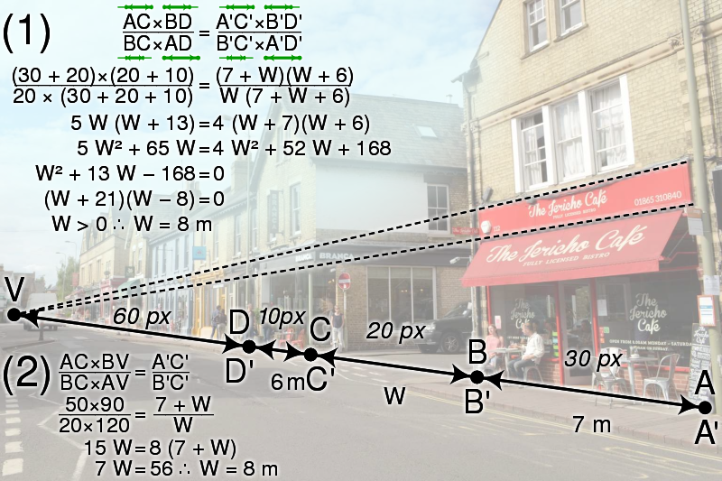
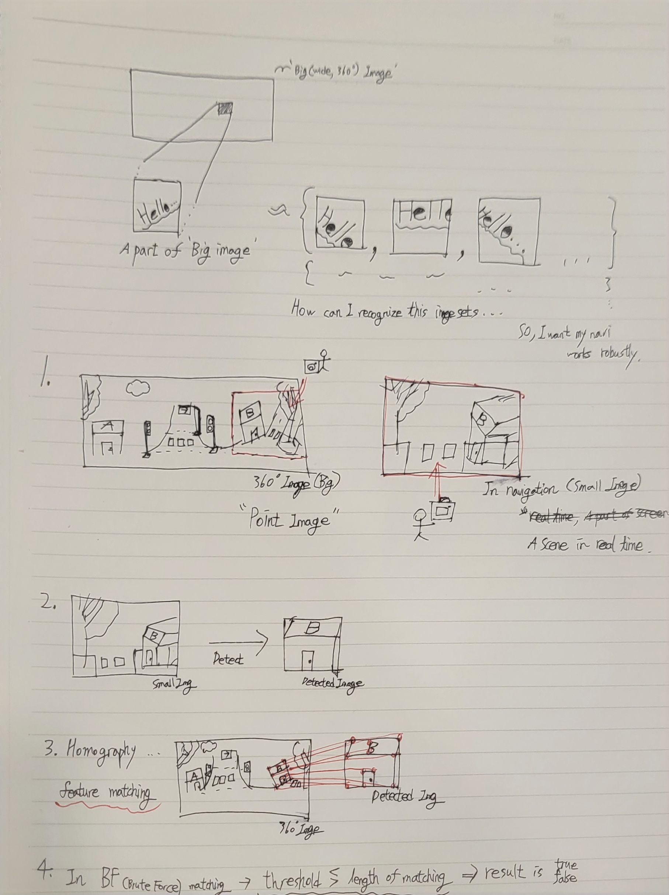
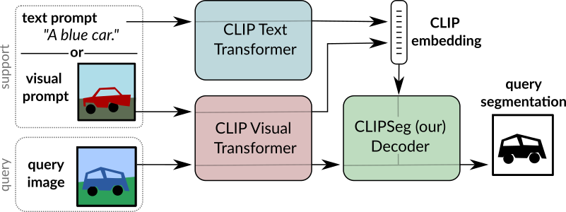
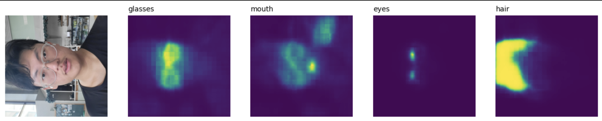
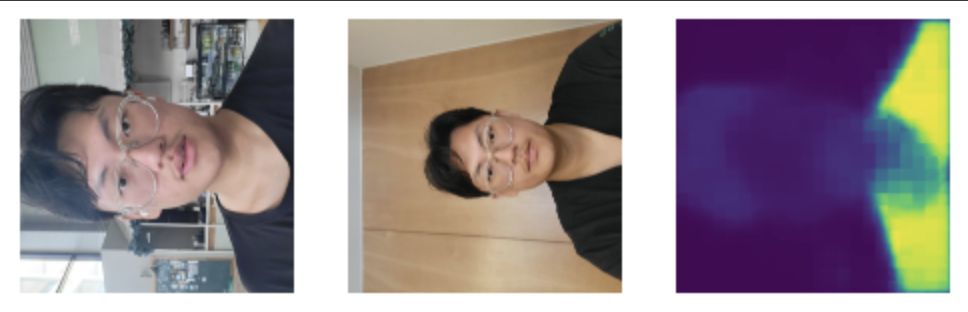

# Img_Recognition

## Abstract

Recognize the image from the image to determine if it exists.  
Images that are part of an image may have been rotated, moved, or changed in brightness   
It presents a variety of methodologies for this  
The final goal is process on real-time & Incremental the image to recognize  

I record various attempts in this repo   

## Matching Template - opencv

Use opencv's matchTemplate, get loc, normalize ..  

Check [template_matching.py](https://github.com/hwk06023/Img_Recognition/blob/main/template_matching.py)
 

In Smart_Camera(Navigation) project [ Easy case ], 

In this case, performance is very nice.  
But, size or rotational transformations (hard cases) do not work well, and slow.  
So, I can't use it  

 

## Feature Detection & Matching - opencv

Use SIFT, SURF, ORB, FAST, BRISK, AKAZE ..  
[Comparative analysis](https://ieeexplore.ieee.org/document/8346440)

If features are simple, use FAST, BRISK ..  
else(complex), use SIFT, SURF, AKAZE ..  

Check [Feature_DetectMatch.py](Feature_DetectMatch.py)

In Smart_Camera(Navigation) project [ Easy case ],

In Smart_Camera(Navigation) project [ Hard case ], 

This case's performance is not good yet..   

This project is demanded working robustly(whether a small image is rotated, moved, or changed in brightness)  
So, I'm doing middle processing to boolean the result from feature detection & matching.  

### Homography

I think if i use this one, my app work robustly.  

  

As far as, I know homography works for planar objects  
So, I use before, detect planar objects in small image    

Ratio = 0.6, Good matches:122/53093

Ratio = 0.5, Good matches:20/53093

Check [Homography.py](Homography.py)

#### solvePnP

solvePnP is

#### BFmatching

BFmatching is BruteForce matching.  
I get the boolean result by using BFmatching  

If Length of matching >= threshold is True  
else(Length of matching < threshold), False.  

I used BFmatching even though I could use FLANN because accuracy is more important than speed.  

Check [BFmatching.py](BFmatching.py)

## Program Scenarios (Feature Matching)

Based on the above contents, I would like to write it as a program  

Check

## One shot learning

An attempt to overcome the vulnerability of the real world  

- [Siamese Neural Networks](https://www.cs.cmu.edu/~rsalakhu/papers/oneshot1.pdf)
- [CLIPSeg](https://arxiv.org/pdf/2103.00020.pdf)

###  Siamese Neural Networks (Conv)

I use [Huggingface](https://huggingface.co/keras-io/siamese-contrastive), [keras.io](https://keras.io/examples/vision/siamese_contrastive/).  

[Siamese_net](siamese_net.ipynb)  

um.. I miss. useless  

### CLIPSeg

I use [Huggingface](https://huggingface.co/blog/clipseg-zero-shot).  

  

Check [CLIPSeg.ipynb](https://github.com/hwk06023/Img_Recognition/blob/main/CLIPSeg.ipynb)  

zero-shot learning test's result is good.  

  

But, On the one-shot learning, The two pictures are about me with different backgrounds, I want Recognize me, but this processer recognize my clothes ..  

  

Um .. I think because my skin color is similar to the background color.  

 

## Augmetation + Few shot learning

An attempt to improve performance in one-shot learning  
I make use of [paperwithcode's git](https://paperswithcode.com/paper/prototypical-networks-for-few-shot-learning)

#### An attempt (Update)
- Metric based learning - [Prototypical Network](https://proceedings.neurips.cc/paper_files/paper/2017/file/cb8da6767461f2812ae4290eac7cbc42-Paper.pdf), Relation Network, ..  
- Model based learning - ..  
- Optimizer learning - ..  
 

### Augemtation

Flipping, Gray scale, Brightness, Rotation ..

Based [this Repo](https://github.com/hwk06023/Augmentation)

### Prototypical Network

### Relation Network

## + Continual learning

Continual learning is required because the task to be processed is constantly updated.  

Based [this Repo](https://github.com/hwk06023/Continual-Learning)  

So, { n-way, n+1-way, n+2-way, ... }

#### reference
https://en.wikipedia.org/wiki/Homography
https://ieeexplore.ieee.org/document/8346440
https://arxiv.org/pdf/2103.00020.pdf
https://paperswithcode.com/paper/prototypical-networks-for-few-shot-learning
https://proceedings.neurips.cc/paper_files/paper/2017/file/cb8da6767461f2812ae4290eac7cbc42-Paper.pdf
https://keras.io/examples/vision/siamese_contrastive