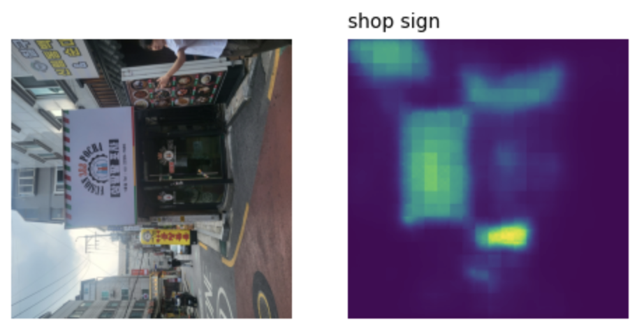
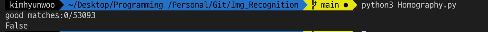
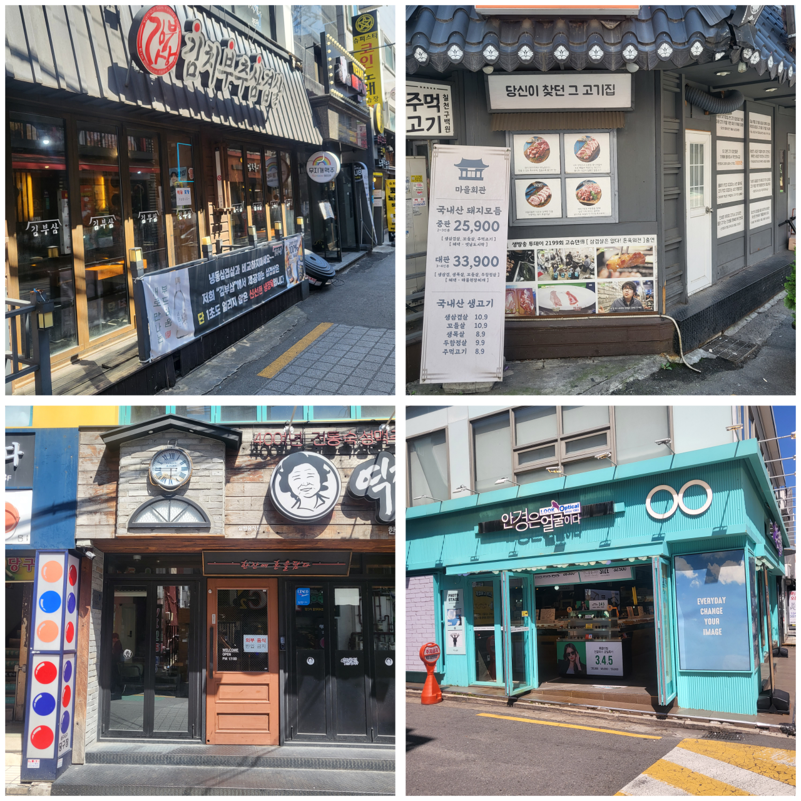
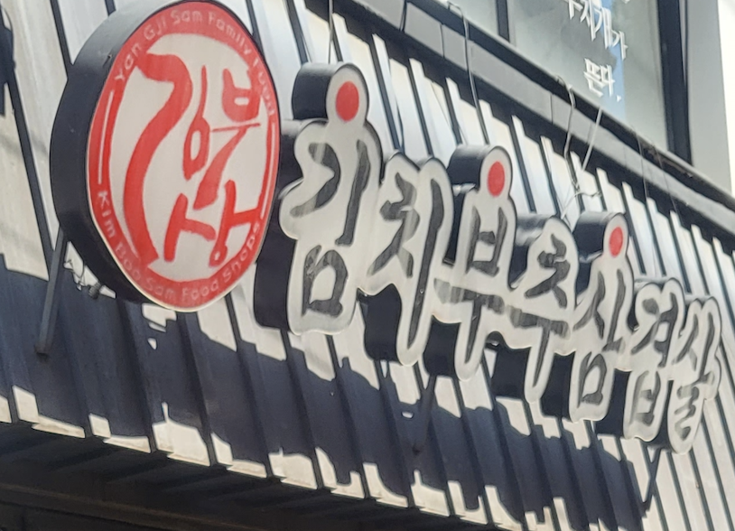
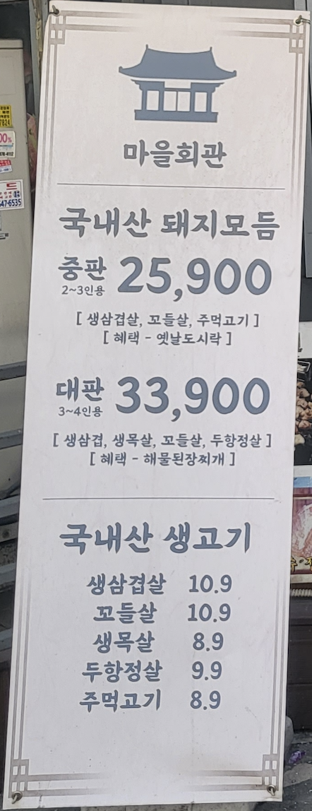
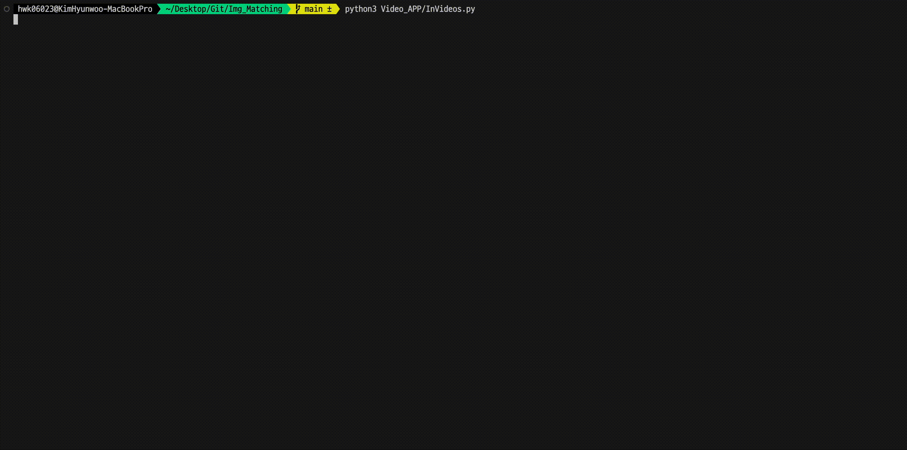
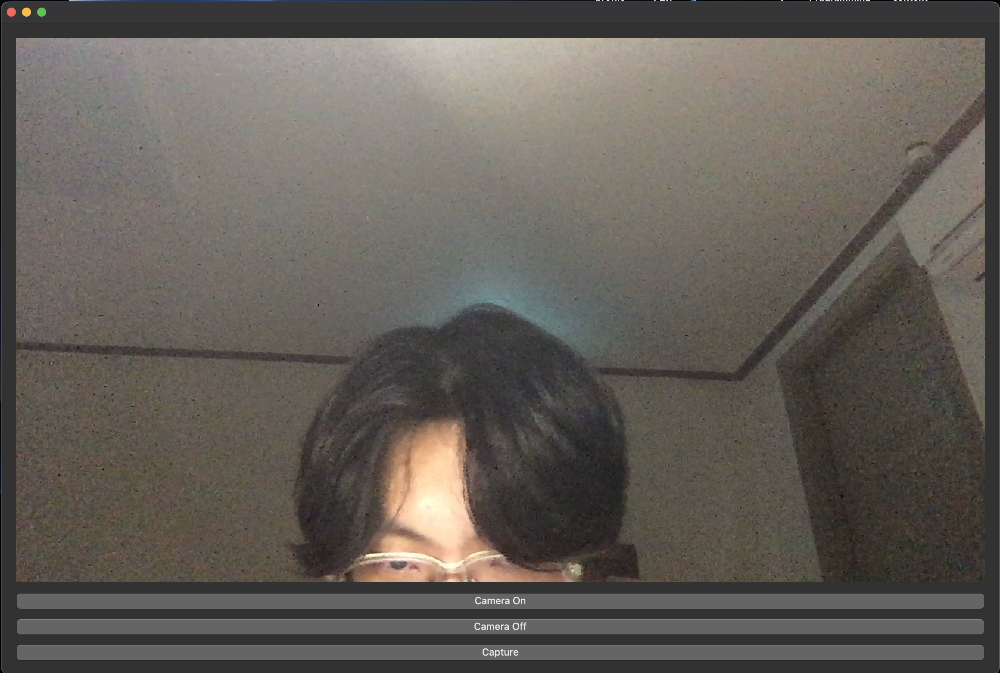
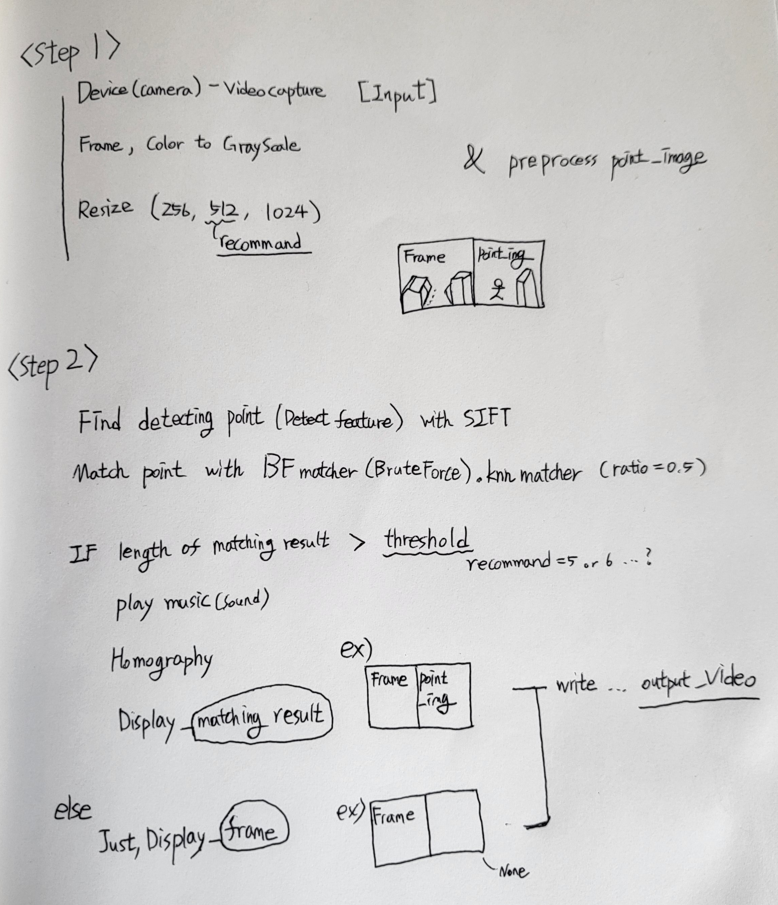

# Template_Matching_RealTime

## Abstract 

Recognize the image from the image to determine if it exists. <br/>
Images that are part of an image may have been rotated, moved, or changed in brightness.  <br/>
It presents a variety of methodologies for this. <br/>
The final goal is process on real-time & Incremental the image to recognize. <br/>

I record various attempts in this repo . <br/>

**Check [Basic_CV repo](https://github.com/hwk06023/Basic_cv) for a detailed Theory.** 


### Outline


<br/><br/>

## Matching Template - opencv

Use opencv's matchTemplate, get loc, normalize .. <br/>

Check [template_matching.py](https://github.com/hwk06023/Img_Recognition/blob/main/template_matching.py)
<br/>

**In Smart_Camera(Navigation) project [ Easy case ]** <br/>
 <br/>


In this case, performance is very nice. <br/>
But, size or rotational transformations (hard cases) do not work well. <br/>
So, I can't use it <br/><br/>


<br/>

## Feature-point Detection & Matching - opencv

Use SIFT, SURF, ORB, FAST, BRISK, AKAZE .. <br/>
[Comparative analysis paper](https://ieeexplore.ieee.org/document/8346440)

If feature-points are simple, use FAST, BRISK .. <br/>
else(complex), use SIFT, SURF, AKAZE .. <br/>

This project's cases are complex. So I use SIFT. <br/><br/>

### SIFT

[Paper](https://www.cs.ubc.ca/~lowe/papers/ijcv04.pdf)


1. **Scale-space extrema detection**: The first stage of computation searches over all scales and image locations. It is implemented efficiently by using a difference-of-Gaussian function to identify potential interest points that are invariant to scale and orientation.

2. **Keypoint localization**: At each candidate location, a detailed model is fit to determine location and scale. Keypoints are selected based on measures of their stability.

3. **Orientation assignment**: One or more orientations are assigned to each keypoint lo- cation based on local image gradient directions. All future operations are performed on image data that has been transformed relative to the assigned orientation, scale, and location for each feature, thereby providing invariance to these transformations.

4. **Keypoint descriptor**: The local image gradients are measured at the selected scale in the region around each keypoint. These are transformed into a representation that allows for significant levels of local shape distortion and change in illumination.

<br/>

If you want more detailed information, check [This docs](https://github.com/hwk06023/Basic_CV#feature-pointkeypoints-detect-and-match) 

<br/>

In code, 

```python
sift = cv2.xfeatures2d.SIFT_create()
kp, des = sift.detectAndCompute(img1, None)
```

kp: keypoints, < cv2.KeyPoint 0x10d4137b0 > <br/>
des: descriptors, ndarray [[n, n, n, .. n], [n, n, n, .. n], [n, n, n, .. n] ..]  <br/>

```python
matches = bf.match(des1, des2)
```

matches: < cv2.DMatch 0x10d4137b0 > 

<br/><br/>

### Result

Check [Feature_DetectMatch.py](Feature_DetectMatch.py)

**In Smart_Camera(Navigation) project [ Easy case ]**

 <br/>
 <br/>

**In Smart_Camera(Navigation) project [ Hard case ]**

 <br/>

This case's performance is not good yet.. <br/><br/>

This project is demanded working robustly(whether a small image is rotated, moved, or changed in brightness) <br/>
So, I'm doing middle processing to boolean the result from feature detection & matching. <br/><br/><br/>

## Homography (A part of Feature Matching)

I think if i use this one, my app work robustly. <br/>


<br/>

As far as, I know homography works for planar objects <br/>
So, I use before, detect planar objects() .. in small image 

#### How can I detect ?

Maybe, I can use Clipseg, which will be shown below



### Result

So.. If I get detected shop_sign image, I could see the good performance by using homography <br/><br/>

#### 1. shop_sign - 1 (True data)

Ratio = 0.6, Good matches:122/53093 <br/>


Ratio = 0.5, Good matches:20/53093 <br/>


<br/>

#### 2. shop_sign - 2 (True data)

Ratio = 0.6, good matches:67/53093 <br/>


Ratio = 0.5, Good matches:20/53093 <br/>


<br/>

#### 3. Iris (False data)

Ratio = 0.6, good matches:13/53093 <br/>


Ratio = 0.5, Good matches:0/53093 <br/>


<br/>

Check [Homography.py](Homography.py) <br/><br/>

Based on the above figures, <br/>
the matching results were good when **ratio = 0.5 and good matches > 5** <br/>

<br/>

### BFmatching

BFmatching is BruteForce matching. <br/>
I get the boolean result by using BFmatching <br/>

If Length of matching >= threshold is True <br/>
else(Length of matching < threshold), False. <br/>

I used BFmatching even when I could use FLANN because in our case accuracy is more important than speed. (I am using SIFT, not ORB for the similar reason.) <br/>

Check [BFmatching.py](BFmatching.py) <br/><br/><br/><br/><br/>


# In Videos

## Program Scenarios 

Based on the above contents, I would like to write it as a program <br/>


## Test Result

### Points

**Original** <br/>
 <br/>

**Preprocessed** <br/>
Only used two points temporarily. <br/>

 <br/>

### Test_Img

 <br/>
 <br/>


### Test_Video

 <br/>

### In terminal (Before)

 <br/>

### In terminal (After)
 <br/>

<br/><br/>


## Supplementation

### Applied

#### Resize (speed)
Which kind of interpolation best for resizing image

### Not yet

In my test above, Point image is not a wide(panorama, 360 ..) image. <br/>
I'll check performance in additional test (Point image is wide image) <br/>

When points are a lot, Maybe This app doesn't work well enough on real-time. <br/>

I want to test with various processing techniques as well as CLIPSeg. (I want to see a change in performancd according to preprocessing) <br/>


<br/>


## In Real-Time GUI Tool

### Interface

 <br/>

### Program Scenarios 

 <br/>

**So, I completed the program.** <br/>

<br/><br/>

***

<br/><br/><br/><br/>

### An approach from a different perspective

Check [Optional_processing.md](Optional_processing.md) <br/>
Check [One_shot_learning.md](One_shot_learning.md) <br/> <br/>

#### Reference
https://en.wikipedia.org/wiki/Homography  <br/>
https://ieeexplore.ieee.org/document/8346440  <br/>
https://arxiv.org/pdf/2103.00020.pdf  <br/>
https://paperswithcode.com/paper/prototypical-networks-for-few-shot-learning  <br/>
https://proceedings.neurips.cc/paper_files/paper/2017/filecb8da6767461f2812ae4290eac7cbc42-Paper.pdf  <br/>
https://keras.io/examples/vision/siamese_contrastive  <br/>