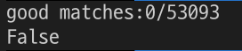

# Img_Recognition

## Abstract 

Recognize the image from the image to determine if it exists. <br/>
Images that are part of an image may have been rotated, moved, or changed in brightness.  <br/>
It presents a variety of methodologies for this. <br/>
The final goal is process on real-time & Incremental the image to recognize. <br/>

I record various attempts in this repo .<br/><br/>

**Check [Basic_CV repo](https://github.com/hwk06023/Basic_cv) for a detailed Theory.** 

<br/>

# Outline

- [Img_Recognition](#img-recognition)
  * [Abstract](#abstract)
  * [Matching Template - opencv](#matching-template---opencv)
  * [Feature-point Detection & Matching - opencv](#feature-point-detection---matching---opencv)
  * [Homography (A part of Feature Matching)](#homography--a-part-of-feature-matching-)
  * [One shot learning](#one-shot-learning)
- [In Videos](#in-videos)
  * [Program Scenarios](#program-scenarios)
  * [Test Result](#test-result)
    + [Case 1 : Between Hanyang Univ & Wangsimni Station](#case-1---between-hanyang-univ---wangsimni-station)
    + [Case 2 : (Updating)](#case-2----updating-)
  * [Supplementation](#supplementation)
- [In Real-Time](#in-real-time)
  * [Program Scenarios](#program-scenarios-1)
  * [Test Result](#test-result-1)
    + [Case 1 : (Updating)](#case-1----updating-)
- [Optional processing](#optional-processing)
  * [Augmetation + Few shot learning](#augmetation---few-shot-learning)
  * [+ Continual learning](#--continual-learning)

<br/><br/>

## Matching Template - opencv

Use opencv's matchTemplate, get loc, normalize .. <br/>

Check [template_matching.py](https://github.com/hwk06023/Img_Recognition/blob/main/template_matching.py)
<br/>

In Smart_Camera(Navigation) project [ Easy case ], 


In this case, performance is very nice. <br/>
But, size or rotational transformations (hard cases) do not work well. <br/>
So, I can't use it <br/><br/>


<br/>

## Feature-point Detection & Matching - opencv

Use SIFT, SURF, ORB, FAST, BRISK, AKAZE .. <br/>
[Comparative analysis paper](https://ieeexplore.ieee.org/document/8346440)

If feature-points are simple, use FAST, BRISK .. <br/>
else(complex), use SIFT, SURF, AKAZE .. <br/>

This project's cases are complex. So I use SIFT. <br/><br/>

### SIFT

[Paper](https://www.cs.ubc.ca/~lowe/papers/ijcv04.pdf)


1. **Scale-space extrema detection**: The first stage of computation searches over all scales and image locations. It is implemented efficiently by using a difference-of-Gaussian function to identify potential interest points that are invariant to scale and orientation.

2. **Keypoint localization**: At each candidate location, a detailed model is fit to determine location and scale. Keypoints are selected based on measures of their stability.

3. **Orientation assignment**: One or more orientations are assigned to each keypoint lo- cation based on local image gradient directions. All future operations are performed on image data that has been transformed relative to the assigned orientation, scale, and location for each feature, thereby providing invariance to these transformations.

4. **Keypoint descriptor**: The local image gradients are measured at the selected scale in the region around each keypoint. These are transformed into a representation that allows for significant levels of local shape distortion and change in illumination.

<br/>

If you want more detailed information, check [This docs](https://github.com/hwk06023/Basic_CV#feature-pointkeypoints-detect-and-match) 

<br/>

In code, 

```python
sift = cv2.xfeatures2d.SIFT_create()
kp, des = sift.detectAndCompute(img1, None)
```

kp: keypoints, < cv2.KeyPoint 0x10d4137b0 > <br/>
des: descriptors, ndarray [[n, n, n, .. n], [n, n, n, .. n], [n, n, n, .. n] ..]  <br/>

```python
matches = bf.match(des1, des2)
```

matches: < cv2.DMatch 0x10d4137b0 > 

<br/><br/>

### Result

Check [Feature_DetectMatch.py](Feature_DetectMatch.py)

In Smart_Camera(Navigation) project [ Easy case ],


In Smart_Camera(Navigation) project [ Hard case ], 


This case's performance is not good yet.. <br/><br/>

This project is demanded working robustly(whether a small image is rotated, moved, or changed in brightness) <br/>
So, I'm doing middle processing to boolean the result from feature detection & matching. <br/><br/><br/>

## Homography (A part of Feature Matching)

I think if i use this one, my app work robustly. <br/>


<br/>

As far as, I know homography works for planar objects <br/>
So, I use before, detect planar objects() .. in small image 

#### How can I detect ?

Maybe, I can use Clipseg, which will be shown below

 <br/>

### Result

So.. If I get detected shop_sign image, I could see the good performance by using homography <br/><br/>

#### 1. shop_sign - 1 (True data)

Ratio = 0.6, Good matches:122/53093 <br/>


Ratio = 0.5, Good matches:20/53093 <br/>


<br/>

#### 2. shop_sign - 2 (True data)

Ratio = 0.6, good matches:67/53093 <br/>


Ratio = 0.5, Good matches:20/53093 <br/>


<br/>

#### 3. Iris (False data)

Ratio = 0.6, good matches:13/53093 <br/>


Ratio = 0.5, Good matches:0/53093 <br/>


<br/>

Check [Homography.py](Homography.py) <br/><br/>

Based on the above figures, <br/>
the matching results were good when ratio = 0.5 and good matches > 5 <br/>

<br/>

### BFmatching

BFmatching is BruteForce matching. <br/>
I get the boolean result by using BFmatching <br/>

If Length of matching >= threshold is True <br/>
else(Length of matching < threshold), False. <br/>

I used BFmatching even when I could use FLANN because in our case accuracy is more important than speed. (I am using SIFT, not ORB for the similar reason.) <br/>

Check [BFmatching.py](BFmatching.py) <br/><br/><br/><br/><br/>

## One shot learning

An attempt to overcome the vulnerability of the real world <br/>

- [Siamese Neural Networks](https://www.cs.cmu.edu/~rsalakhu/papers/oneshot1.pdf)
- [CLIPSeg](https://arxiv.org/pdf/2103.00020.pdf)

###  Siamese Neural Networks (Conv)

I use [Huggingface](https://huggingface.co/keras-io/siamese-contrastive), [keras.io](https://keras.io/examples/vision/siamese_contrastive/). <br/>

[Siamese_net](siamese_net.ipynb) <br/>

um.. I miss. useless <br/>


### CLIPSeg

I use [Huggingface](https://huggingface.co/blog/clipseg-zero-shot). <br/>

 <br/>

Check [CLIPSeg.ipynb](https://github.com/hwk06023/Img_Recognition/blob/main/CLIPSeg.ipynb) <br/>

zero-shot learning test's result is good. <br/>

 <br/>

But, On the one-shot learning, The two pictures are about me with different backgrounds, I want Recognize me, but this processer recognize my clothes .. <br/>


 <br/>

Um .. I think because my skin color is similar to the background color. <br/>

<br/><br/><br/><br/>

***

# In Videos


## Program Scenarios 

Based on the above contents, I would like to write it as a program <br/>


### In the image above, Recorrection

In Step 2 : Detected Image doesn't detected in small image, -> Detected by big image(point image)

<br/><br/>

## Test Result

### Case 1 : Between Hanyang Univ & Wangsimni Station

#### Points


#### Test_Video

Only used two points temporarily.


#### In terminal (1024 x 1024 slow version)


<br/><br/>

### Case 2 : (Updating)
 
<br/><br/><br/>

## Supplementation

### Applied

#### Resize (speed)
Which kind of interpolation best for resizing image

### Not yet

In my test above, Point image is not a wide(panorama, 360 ..) image. <br/>
I'll check performance in additional test (Point image is wide image) <br/>

When points are a lot, Maybe This app doesn't work well enough on real-time. <br/>

I want to test with various processing techniques as well as CLIPSeg. (I want to see a change in performancd according to preprocessing) <br/>


<br/><br/><br/>

***

# In Real-Time GUI Tool

## Interface


## Program Scenarios 


## Test Result

### Case 1 : (Updating)

#### Points

#### In terminal

<br/><br/>

***

<br/><br/><br/><br/><br/><br/>

# Optional processing

## Augmetation + Few shot learning

An attempt to improve performance in one-shot learning <br/>
I make use of [paperwithcode's git](https://paperswithcode.com/paper/prototypical-networks-for-few-shot-learning)

#### An attempt (Update)
- Metric based learning - [Prototypical Network](https://proceedings.neurips.cc/paper_files/paper/2017/file/cb8da6767461f2812ae4290eac7cbc42-Paper.pdf), Relation Network, .. <br/>
- Model based learning - .. <br/>
- Optimizer learning - .. <br/>
<br/>

### Augemtation

Flipping, Gray scale, Brightness, Rotation ..

Based [this Repo](https://github.com/hwk06023/Basic_cv)


### Prototypical Network


### Relation Network


<br/><br/><br/>


## + Continual learning

Continual learning is required because the task to be processed is constantly updated. <br/>

Based [this Repo](https://github.com/hwk06023/Continual-Learning) <br/>

#### Reference
https://en.wikipedia.org/wiki/Homography  <br/>
https://ieeexplore.ieee.org/document/8346440  <br/>
https://arxiv.org/pdf/2103.00020.pdf  <br/>
https://paperswithcode.com/paper/prototypical-networks-for-few-shot-learning  <br/>
https://proceedings.neurips.cc/paper_files/paper/2017/filecb8da6767461f2812ae4290eac7cbc42-Paper.pdf  <br/>
https://keras.io/examples/vision/siamese_contrastive  <br/>